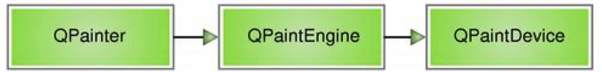

# QT  paint 绘图

Qt 的绘图系统允许使用相同的 API 在屏幕和其它打印设备上进行绘制。整个绘 图系统基于 QPainter，QPainterDevice 和 QPaintEngine 三个类。

QPainter 用来执行绘制的操作；QPaintDevice 是一个二维空间的抽象，这个二 维空间允许 QPainter 在其上面进行绘制， 也就是 QPainter 工作的空间； QPaintEngine 提供了画笔（QPainter）在不同的设备上进行绘制的统一的接口。 QPaintEngine 类应用于 QPainter 和 QPaintDevice 之间，通常对开发人员是透 明的。除非你需要自定义一个设备，否则你是不需要关心 QPaintEngine 这个类 的。我们可以把 QPainter 理解成画笔；把 QPaintDevice 理解成使用画笔的地方， 比如纸张、屏幕等；而对于纸张、屏幕而言，肯定要使用不同的画笔绘制，为了 统一使用一种画笔，我们设计了 QPaintEngine 类，这个类让不同的纸张、屏幕 都能使用一种画笔。

这三个类之间的层次结构:




Qt 的 绘 图 系 统 实 际 上 是 ， 使 用 QPainter 在 QPainterDevice 上进行绘制，它们之间使用 QPaintEngine 进行通讯（也就是翻 译 QPainter 的指令）。


## 使用paintEvent 画背景图片


1. 在头文件中声明绘图事件

   ~~~h
   public:
       Widget(QWidget *parent = nullptr);
       ~Widget();
       virtual void paintEvent(QPaintEvent *event);
   ~~~

   

2. 在源文件中实现绘图事件

   ~~~cpp
   
   // 重写绘图事件   这里是 主窗口加载的时候自动调用的
   void Widget::paintEvent(QPaintEvent *event)
   {
   
       // 定义一个画家  画图片
       QPainter *painter = new QPainter(this);
   
       // 定义一个图片控件
       QPixmap pix;
       pix.load(":/assets/img/tiger_th.jpeg");
   
       // 修改图片大小  和窗口一样大小
       pix.scaled(this->width(), this->height());
   
       // 画家在主窗口绘画  这里注意想要和上面的 pixmap 一致
       painter->drawPixmap(0,0,this->width(),this->height(), pix);
   
   }
   
   ~~~


### 移动图片

在构造函数中 设置button和移动button到窗口底部中间位置, 并注册BUTTON事件,  在事件中使用 update()函数来更新绘画事件函数 paintEvent

~~~cpp

    // 将button放到窗口的最下面中间位置
    // 窗口的宽高   this->width()    this->height()
    // 按钮的宽高   ui->pushButton->width()  ui->pushButton->height()
    ui->pushButton->resize(100,50); // 调整按钮的大小

    // 移动button到底部中间位置
    ui->pushButton->move( (this->width()*0.5 - ui->pushButton->width()*0.5),\
        this->height() - ui->pushButton->height() );

    connect(ui->pushButton,&QPushButton::clicked,[=](){
        this->update(); // 更新时就会触发绘图事件
    });


~~~

绘图事件实现

~~~cpp

// 重写绘图事件   这里是 主窗口加载的时候自动调用的
void Widget::paintEvent(QPaintEvent *event)
{

    // 定义一个画家  画图片
    QPainter *painter = new QPainter(this);

    // 定义一个图片控件
    QPixmap pix;
    pix.load(":/assets/img/fly-pig.jpg");

    pix.scaled(pix.width()*0.5, pix.height()*0.5 ); // 图片缩小一半

    static int x = 0,y=0;

    painter->drawPixmap(x, y, pix.width(), pix.height(), pix);

    x+=10;
//    y+=10; // 开启后图片就会朝着右下角移动

    //超出边框后将x y回到原点
    if( x >= this->width()){
        x=0;
    }else if (y >=this->height() ) {
        y=0;
    }

    qDebug()<<"x="<<x<<" y="<<y;

}

~~~


###  画线 drawLine


```cpp
    // 定义一个画家 
    QPainter *painter = new QPainter(this);

    // 画家画线
    painter->drawLine(0,0,500,500);
```


### 画矩形 rectangle         drawRectl

~~~cpp

    // 画矩形框
    painter->drawRect(50,50, 200,200);

~~~


~~~cpp
 //设置画笔颜色
    painter->setPen(QColor("red"));
 
// 画圆
    painter->drawEllipse(180,80, 500,500);

~~~


## 绘图设备

绘图设备是指继承 QPainterDevice 的子类。Qt 一共提供了四个这样的类，分别 是 QPixmap、QBitmap、QImage 和 QPicture。其中， 

- QPixmap 专门为图像在屏幕上的显示做了优化 
- QBitmap 是 QPixmap 的一个子类，它的色深限定为 1，可以使用 QPixmap 的 isQBitmap()函数来确定这个 QPixmap 是不是一个 QBitmap。 
- QImage 专门为图像的像素级访问做了优化。 
- QPicture 则可以记录和重现 QPainter 的各条命令。


QBitmap 继承自 QPixmap，因此具有 QPixmap 的所有特性，提供单色图像。

QBitmap 实际上是只有黑白两色的图像数据。 由于 QBitmap 色深小，因此只占用很少的存储空间，所以适合做光标文件和笔 刷。


QPixmap 使用底层平台的绘制系统进行绘制， 无法提供像素级别的操作， 而 QImage 则是使用独立于硬件的绘制系统，实际上是自己绘制自己，因此提供了 像素级别的操作，并且能够在不同系统之上提供一个一致的显示形式。


如果想在主窗口中绘图  则需要在绘图事件里面绘图,  如果仅仅是在绘图设备上面绘图或者保存绘图,则可不用再绘图事件中绘图,在构造函数中即可


如: 直接在构造函数中画图后保存到本地当前文件夹

~~~cpp
  // 定义一个绘图设备
    QBitmap bitmap(300,300);
    // 定义一个画家  由于这里的参数是指针,所以需要传递一个bitmap的地址
    QPainter painter(&bitmap);

    painter.drawEllipse(QPoint(100,100),50,50);
    //保存图片
    bitmap.save("./mybitmap.jpg");

~~~


### img的像素操作

在widget.cpp 的构造函数中实现

~~~cpp
 // 定义一个QImage设备
    QImage img;
    // 加载一张图片
    img.load(":/assets/img/great.jpg");
    img.scaled(1024,1024); // 重置图片大小

		// 像素处理
    int value = qRgb(255,0,0);
    for (int i=300; i<800 ;i++ ) {
        for (int j=300;j<800 ;j++ ) {
           //设置像素
            img.setPixel(i,j,value);
        }
    }

    QPainter painter2(&img);// 定义一个画家
    painter2.drawEllipse(QPoint(900,900),600,600); // 画圆形
    img.save("./qimg.jpg"); // 保存图片

~~~


### 记录绘图指令并保存指令到硬盘

在widget.cpp的构造函数中实现

~~~cpp

    // 定义绘图设备
    QPicture picture;
    // 定义画家
    QPainter painterp;

    //记录绘图指令
    painterp.begin(&picture);

    // 画圆
    painterp.drawEllipse(100,100,100,100);

    // 结束记录绘图指令
    painterp.end();

    // 保存绘图指令
    picture.save("/tmp/pic.zl");
    qDebug("绘图指令保存成功");
~~~


### 重现绘图指令到主窗口 在widget.cpp 的paintEvent事件中实现

~~~cpp
    // 在paintEvent事件中 重现绘图指令到主窗口
    // 定义绘图设备
    QPicture picture;
    // 定义画家
    QPainter painterp(this);
    // 加载绘图指令
    picture.load("/tmp/pic.zl");

    //画家根据绘图指令绘图
    painterp.drawPicture(10,390,picture);

~~~


